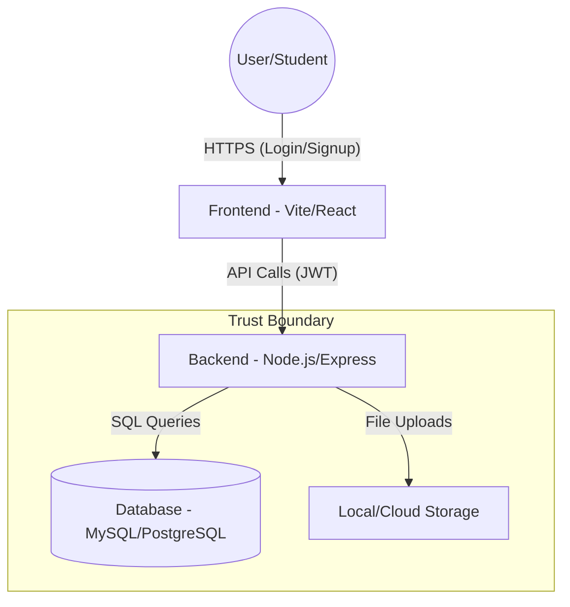

# Threat Model: StudentHub

This document outlines the threat model for the **StudentHub** platform, focusing on identifying potential security risks and establishing trust boundaries.

## 1. Assets
- **User Data**: Names, emails, phone numbers, and profile bios.
- **Credentials**: Hashed passwords, JWT tokens, and OTP codes.
- **Files**: User-uploaded documents and images.
- **Infrastructure**: API endpoints, database records, and server logs.

## 2. Threat Actors
- **External Attacker**: Unauthorized individuals attempting to gain access via the internet.
- **Malicious Insider**: Registered users trying to access other users' data or elevate their privileges.
- **Script Kiddies**: Automated tools scanning for common misconfigurations.

## 3. Data Flow Diagram (DFD)

## 4. STRIDE Analysis

| Category | Threat | Mitigation |
| :--- | :--- | :--- |
| **Spoofing** | Attacker logs in as another student using stolen credentials. | Multi-factor authentication (OTP) and strong password hashing (Bcrypt). |
| **Tampering** | Attacker modifies another student's profile or uploaded files. | Implement proper IDOR (Insecure Direct Object Reference) checks on all API endpoints. |
| **Repudiation** | User deletes content and denies doing so. | Implement comprehensive audit logging for sensitive actions. |
| **Information Disclosure** | Sensitive errors or `.env` files exposed to the public. | Disable detailed error messages in production and use environment variables securely. |
| **Denial of Service** | Attacker floods the API with requests, making it unavailable. | Implement rate limiting (Express-Rate-Limit) and Web Application Firewall (WAF). |
| **Elevation of Privilege** | Regular student accesses admin dashboard or moderation tools. | Role-Based Access Control (RBAC) and strict server-side validation of roles. |

## 5. Trust Boundaries
- **External Boundary**: Between the User and the Frontend/API.
- **Internal Boundary**: Between the API and the Database/Internal Services.
